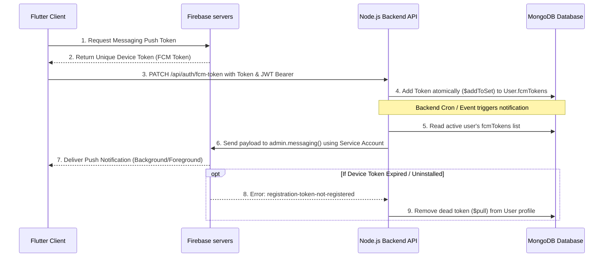

# Firebase Cloud Messaging (FCM) System Setup Guide
A complete architectural blueprint and configuration manual for implementing production-grade cross-platform push notifications (Android, iOS, Web) using Flutter and Node.js.

---

## 1. Architectural Flow
The notification system is designed to trigger alerts when portfolio conditions change. It follows a decoupled, secure token registration pattern:



---

## 2. Firebase Console Configuration Guide

To support Firebase, you must create a centralized project and register credentials for each platform.

### Step 1: Create a Firebase Project
1. Open the [Firebase Console](https://console.firebase.google.com/).
2. Click **Add project**, enter a project name (e.g., `EgxNotifications`), and click **Continue**.
3. Choose whether to enable Google Analytics, then click **Create project**.

### Step 2: Configure Platforms & Acquire App Config Files

#### A. Android Setup
1. In the Project Overview page, click the **Android** icon (or go to **Project Settings > General > Your apps > Add app**).
2. Enter your **Android package name** (found in `android/app/build.gradle` inside `defaultConfig { applicationId "your.package.id" }`).
3. Click **Register app**.
4. Download the `google-services.json` file.
5. Move this file into your Flutter project at `android/app/google-services.json`.

#### B. iOS Setup
1. In your Firebase Project Settings, click **Add app** and select the **iOS** icon.
2. Enter your **iOS Bundle ID** (found in Xcode under the **Runner General** tab or `ios/Runner.xcodeproj/project.pbxproj` under `PRODUCT_BUNDLE_IDENTIFIER`).
3. Click **Register app** and download `GoogleService-Info.plist`.
4. Drag and drop this file inside Xcode into the `Runner/Runner` directory (ensuring "Copy items if needed" is checked).
5. **APNs Certificate Setup (Crucial for iOS background delivery)**:
   - Go to the Apple Developer Account > **Certificates, Identifiers & Profiles** > **Keys**.
   - Create an APNs Auth Key (.p8 file) and download it. Note the Key ID and Team ID.
   - Back in the Firebase Console, go to **Settings > Project Settings > Cloud Messaging > iOS app configuration**.
   - Upload your `.p8` key, and input the Key ID and Xcode Team ID.

#### C. Web Setup & VAPID Key Configuration
1. Click **Add app** and select the **Web** ( `</>` ) icon.
2. Name your Web app and click **Register App**.
3. Under the firebase configuration snippet, note the config values (apiKey, authDomain, projectId, appId, etc.) to set up `firebase_options.dart`.
4. Go to **Project Settings > Cloud Messaging**.
5. Scroll down to the **Web configuration** card, and under **Web Push certificates**, click **Generate key pair**.
6. Copy the generated public key. This key is your **Web VAPID Key** (a long alphanumeric string starting with `B...`). It is required by the Flutter Web client to request web push tokens.

### Step 3: Get Backend Service Account Key JSON
To grant your Node.js backend permission to push messages to Firebase:
1. In the Firebase Console, go to **Project Settings > Service accounts**.
2. Make sure the Node.js radio button is selected and click **Generate new private key**.
3. A JSON file will automatically download (e.g., `project-id-firebase-adminsdk-xxxxx.json`).
4. Keep this file highly secure. Do not commit it to Github. You will load its content as an environment variable (`FIREBASE_SERVICE_ACCOUNT`).

---

## 3. Flutter App Implementation

### Prerequisites
Add dependencies to your `pubspec.yaml`:
```yaml
dependencies:
  flutter:
    sdk: flutter
  firebase_core: ^3.0.0
  firebase_messaging: ^15.0.0
  flutter_local_notifications: ^17.0.0
```

Ensure Android platform setups:
- Add Google Services plugin in `android/build.gradle`:
  ```groovy
  dependencies {
      classpath 'com.google.gms:google-services:4.4.1'
  }
  ```
- Add the plugin application in `android/app/build.gradle`:
  ```groovy
  apply plugin: 'com.android.application'
  apply plugin: 'com.google.gms.google-services' // Add at the bottom
  ```

### Notification Service Class
Create a modular class `lib/services/notification_service.dart` to coordinate initialization, permissions, heads-up message alerts, foreground intercepts, and backend updates:

```dart
import 'dart:io';
import 'package:firebase_core/firebase_core.dart';
import 'package:firebase_messaging/firebase_messaging.dart';
import 'package:flutter/foundation.dart';
import 'package:flutter_local_notifications/flutter_local_notifications.dart';
import '../firebase_options.dart'; // File generated via 'flutterfire configure'

class NotificationService {
  static final NotificationService _instance = NotificationService._internal();
  factory NotificationService() => _instance;
  NotificationService._internal();

  FirebaseMessaging? _fcm;
  FlutterLocalNotificationsPlugin? _localNotifications;
  bool _isInit = false;

  // Web VAPID key generated from Firebase Console -> Settings -> Cloud Messaging -> Web Push certificates
  final String _webVapidKey = 'YOUR_FIREBASE_WEB_VAPID_PUBLIC_KEY';

  Future<void> init() async {
    if (_isInit) return;
    
    try {
      // 1. Initialize Firebase Core
      if (Firebase.apps.isEmpty) {
        await Firebase.initializeApp(
          options: DefaultFirebaseOptions.currentPlatform,
        );
      }
      _fcm = FirebaseMessaging.instance;
    } catch (e) {
      debugPrint('Firebase initialization error: $e');
      return;
    }

    // 2. Request user permissions (Critical for iOS and Android 13+)
    final settings = await _fcm!.requestPermission(
      alert: true,
      badge: true,
      sound: true,
    );
    debugPrint('Notification Permission status: ${settings.authorizationStatus}');

    // 3. Setup flutter_local_notifications for Foreground Heads-Up Popups on Android/iOS
    if (!kIsWeb) {
      _localNotifications = FlutterLocalNotificationsPlugin();
      
      const AndroidInitializationSettings androidSettings =
          AndroidInitializationSettings('@mipmap/ic_launcher');
          
      const DarwinInitializationSettings darwinSettings =
          DarwinInitializationSettings(
            requestAlertPermission: true,
            requestBadgePermission: true,
            requestSoundPermission: true,
          );
          
      const InitializationSettings initSettings = InitializationSettings(
        android: androidSettings,
        iOS: darwinSettings,
      );
      
      await _localNotifications!.initialize(initSettings);

      // Create high importance channel for Android custom alerts
      const AndroidNotificationChannel channel = AndroidNotificationChannel(
        'app_alerts_channel', // Identical ID to backend channelId
        'App Urgent Alerts',
        description: 'Delivers immediate rebalancing recommendations and warnings.',
        importance: Importance.max,
        playSound: true,
      );

      await _localNotifications!
          .resolvePlatformSpecificImplementation<
            AndroidFlutterLocalNotificationsPlugin
          >()
          ?.createNotificationChannel(channel);
    }

    // 4. Foreground Message Listener: Show custom overlay banner while user is inside the app
    FirebaseMessaging.onMessage.listen((RemoteMessage message) async {
      debugPrint('Received foreground notification: ${message.notification?.title}');
      if (!kIsWeb) {
        _showLocalNotification(message);
      }
    });

    // 5. Background Tap Listener: Trigger action when user taps on a notification to open the app
    FirebaseMessaging.onMessageOpenedApp.listen((RemoteMessage message) async {
      debugPrint('App opened via notification action: ${message.data}');
    });

    _isInit = true;
    await updateToken();
  }

  // 6. Request and register device token with custom REST Api
  Future<void> updateToken() async {
    try {
      if (!_isInit || _fcm == null) return;

      // iOS APNs Synchronization Check
      if (!kIsWeb && Platform.isIOS) {
        int retryCount = 0;
        String? apnsToken;
        while (retryCount < 5 && apnsToken == null) {
          apnsToken = await _fcm!.getAPNSToken();
          if (apnsToken == null) {
            await Future.delayed(const Duration(seconds: 2));
            retryCount++;
          }
        }
      }

      // Fetch Device-Specific FCM Token
      final token = kIsWeb
          ? await _fcm!.getToken(vapidKey: _webVapidKey)
          : await _fcm!.getToken();

      if (token != null) {
        debugPrint('FCM Token generated: $token');
        await _sendTokenToBackend(token);
      }
    } catch (e) {
      debugPrint('Error updating FCM token: $e');
    }
  }

  // Local helper to execute authorized PATCH
  Future<void> _sendTokenToBackend(String token) async {
    // Standard HTTP client calls to PATCH /api/auth/fcm-token
    // Example:
    // http.patch(
    //   Uri.parse('$apiBaseUrl/api/auth/fcm-token'),
    //   headers: {'Content-Type': 'application/json', 'Authorization': 'Bearer $jwtToken'},
    //   body: jsonEncode({'fcmToken': token}),
    // );
  }

  // Render heads-up banner on devices for foreground intercepts
  void _showLocalNotification(RemoteMessage message) {
    if (_localNotifications == null) return;

    const AndroidNotificationDetails androidDetails =
        AndroidNotificationDetails(
          'app_alerts_channel',
          'App Urgent Alerts',
          importance: Importance.max,
          priority: Priority.high,
          playSound: true,
        );
        
    const DarwinNotificationDetails darwinDetails = DarwinNotificationDetails(
      presentAlert: true,
      presentBadge: true,
      presentSound: true,
    );

    const NotificationDetails details = NotificationDetails(
      android: androidDetails,
      iOS: darwinDetails,
    );

    _localNotifications!.show(
      message.notification.hashCode,
      message.notification?.title,
      message.notification?.body,
      details,
    );
  }
}
```

---

## 4. Node.js Backend Implementation

### Step 1: Install Firebase Admin SDK
Install dependencies in your Node.js directory:
```bash
npm install firebase-admin mongoose env2
```

### Step 2: Database User Model Update
Configure your User Model to store an array of registration tokens. Users can have multiple Active devices simultaneously (e.g. tablet, phone, desktop web).

```javascript
// models/User.js
const mongoose = require('mongoose');

const UserSchema = new mongoose.Schema({
    email: { type: String, required: true, unique: true },
    name: { type: String, required: true },
    password: { type: String, required: true },
    fcmTokens: {
        type: [String],
        default: []
    }
}, { timestamps: true });

module.exports = mongoose.model('User', UserSchema);
```

### Step 3: Firebase Admin Setup & Notification Service

Implement checking logic, payload formats per platform, and self-cleaning mechanism to prune inactive/dead device tokens. In typical configurations, credentials JSON can be saved either as stringified JSON directly or as a file path under the `FIREBASE_SERVICE_ACCOUNT` environment variable.

```javascript
// utils/fcmManager.js
const admin = require('firebase-admin');
const path = require('path');
const { User } = require('../models');

class FcmManager {
    constructor() {
        this.isInitialized = false;
        this._initializeFirebase();
    }

    _initializeFirebase() {
        try {
            const credentialsEnv = process.env.FIREBASE_SERVICE_ACCOUNT;
            if (credentialsEnv) {
                let serviceAccount;
                const trimmed = credentialsEnv.trim();
                
                // Support both inline JSON string and file path
                if (trimmed.startsWith('{')) {
                    serviceAccount = JSON.parse(trimmed);
                } else {
                    const absolutePath = path.isAbsolute(trimmed) 
                        ? trimmed 
                        : path.resolve(process.cwd(), trimmed);
                    serviceAccount = require(absolutePath);
                }

                admin.initializeApp({
                    credential: admin.credential.cert(serviceAccount)
                });
                
                this.isInitialized = true;
                console.log('Firebase Admin SDK initialized successfully.');
            } else {
                console.warn('FIREBASE_SERVICE_ACCOUNT not configured. FCM push notifications disabled.');
            }
        } catch (error) {
            console.error('Failed to initialize Firebase Admin:', error);
        }
    }

    /**
     * Sends custom notifications to all user registered tokens.
     * Includes self-cleaning logic for dead tokens.
     */
    async sendFcmNotification(userId, title, body, titleAr = null, bodyAr = null, data = {}) {
        try {
            const user = await User.findById(userId);
            if (!user || !user.fcmTokens || user.fcmTokens.length === 0) {
                return;
            }

            const isArabic = user.language === 'ar';
            const selectedTitle = (isArabic && titleAr) ? titleAr : (title || 'MediSync');
            const selectedBody = (isArabic && bodyAr) ? bodyAr : body;

            if (!this.isInitialized) {
                console.log(`[Mock Notification Log] User: ${user.email} | Title: ${selectedTitle} | Content: ${selectedBody}`);
                return;
            }

            const invalidTokens = [];
            const sanitizedData = {};
            if (data) {
                for (const key in data) {
                    if (data[key] !== undefined && data[key] !== null) {
                        sanitizedData[key] = String(data[key]);
                    }
                }
            }

            const sendPromises = user.fcmTokens.map(async (token) => {
                try {
                    const message = {
                        token: token,
                        notification: {
                            title: selectedTitle,
                            body: selectedBody,
                        },
                        data: sanitizedData,
                        android: {
                            priority: 'high',
                            notification: {
                                channelId: 'app_alerts_channel', // Match local notification configuration ID
                                sound: 'default',
                            }
                        },
                        apns: {
                            payload: {
                                aps: {
                                    sound: 'default',
                                    badge: 1,
                                }
                            }
                        },
                        webpush: {
                            headers: {
                                Urgency: 'high'
                            },
                            notification: {
                                body: selectedBody,
                                icon: '/favicon.png'
                            }
                        }
                    };

                    await admin.messaging().send(message);
                    console.log(`FCM Alert pushed to ${user.email} for device token ${token.substring(0, 12)}...`);
                } catch (error) {
                    // Identify expired or inactive device registers
                    if (error.code === 'messaging/registration-token-not-registered' ||
                        error.code === 'messaging/invalid-registration-token') {
                        invalidTokens.push(token);
                    } else {
                        console.error(`FCM transfer issue for token ${token.substring(0, 10)}:`, error.message);
                    }
                }
            });

            await Promise.all(sendPromises);

            // Prune dead registries from user profile automatically
            if (invalidTokens.length > 0) {
                await User.findByIdAndUpdate(userId, {
                    $pull: { fcmTokens: { $in: invalidTokens } }
                });
                console.log(`Cleaned up ${invalidTokens.length} dead FCM tokens from ${user.email}'s account.`);
            }

        } catch (error) {
            console.error('Error in sendFcmNotification:', error);
        }
    }
}

module.exports = new FcmManager();
```

### Step 4: Token Registration API Endpoints

Add routes to update the backend on login/logout changes:

```javascript
// controllers/authController.js
const { User } = require('../models');

// @desc    Register a new FCM device token for the user
// @route   PATCH /api/auth/fcm-token
exports.registerFcmToken = async (req, res) => {
    try {
        const { fcmToken } = req.body;
        if (!fcmToken) {
            return res.status(400).json({ success: false, message: 'fcmToken is required.' });
        }

        await User.findByIdAndUpdate(req.user._id, {
            $addToSet: { fcmTokens: fcmToken }
        });

        res.status(200).json({ success: true, message: 'FCM Token registered successfully.' });
    } catch (error) {
        res.status(500).json({ success: false, message: error.message });
    }
};

// @desc    Deregister an FCM device token
// @route   POST /api/auth/logout-fcm
exports.deregisterFcmToken = async (req, res) => {
    try {
        const { fcmToken } = req.body;
        if (!fcmToken) {
            return res.status(400).json({ success: false, message: 'fcmToken is required.' });
        }

        await User.findByIdAndUpdate(req.user._id, {
            $pull: { fcmTokens: fcmToken }
        });

        res.status(200).json({ success: true, message: 'FCM Token deregistered successfully.' });
    } catch (error) {
        res.status(500).json({ success: false, message: error.message });
    }
};
```

Apply auth middleware to secure the routes inside `routes/authRoutes.js`:
```javascript
const express = require('express');
const router = express.Router();
const { registerFcmToken, deregisterFcmToken } = require('../controllers/authController');
const { protect } = require('../middlewares/authMiddleware'); // Standard JWT validation middleware

router.patch('/fcm-token', protect, registerFcmToken);
router.post('/logout-fcm', protect, deregisterFcmToken);

module.exports = router;
```

---

## 5. Deployment Checklist
- [ ] Set `FIREBASE_SERVICE_ACCOUNT` in your backend server environment settings.
- [ ] Add `google-services.json` to the target Android app's folder.
- [ ] Hook `GoogleService-Info.plist` inside target iOS Xcode hierarchy.
- [ ] Map active Apple Developer APNs Keys (`.p8`) to Firebase Server Settings.
- [ ] Ensure that VAPID public key string matches variables configured inside Flutter Web clients.
- [ ] Turn on **Push Notifications** and **Background Modes** (Remote notifications) under Capabilities tab in Xcode.
