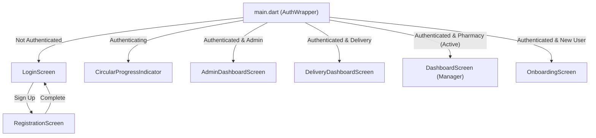
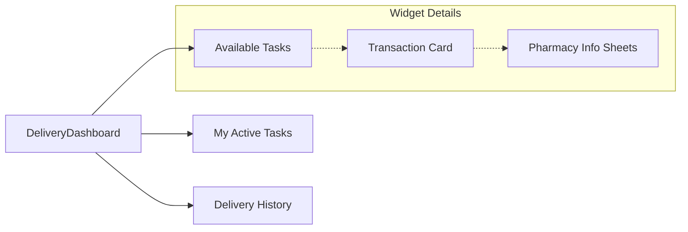

# MediSync Frontend UI Visual Map

This document provides a visualization of the frontend screen and widget hierarchy. Use this to identify specific components when requesting modifications.

## High-Level Application Flow
This diagram shows how users enter the app and are routed based on their role and authentication status.

---

## Dashboard Structures

### 1. Pharmacy Dashboard (`DashboardScreen`)
The main dashboard for pharmacies and managers. It uses a **Bottom Navigation Bar**.

| Navigation Item | Screen / Tab | Purpose |
| :--- | :--- | :--- |
| **Home** | `HomeTab` | Urgency news marquee, ads, and quick action grid. |
| **History**| `RequestsHistoryScreen` | List of all past shortages and excess requests. |
| **Cart** | `PendingCart` | (Placeholder) Area for managing pending orders. |
| **Account** | `ProfileScreen` | User settings, balance, and account management. |

#### `HomeTab` Decomposition
- **News Marquee**: Top red bar showing urgent shortages.
- **Advertisement Card**: Large gradient banner for announcements.
- **Action Grid**: 2-column grid of cards (Add Excess, Add Shortage, etc.).

---

### 2. Admin Dashboard (`AdminDashboardScreen`)
A unified central hub for system management, featuring a scrollable **2-column Grid**.

| Component | Responsibility / Sub-Screens |
| :--- | :--- |
| **Header** | Logo, Refresh button, Notifications, Profile link. |
| **Action Grid** | Cards leading to specific management modules (Users, Products, etc.). |
| **Modules** | - `AdminMatchableProductsScreen` (Transactions) - `AdminManageUsersScreen` - `AdminProductListScreen` - `AdminOrderListScreen` - `AdminSettingsScreen` |

---

### 3. Delivery Dashboard (`DeliveryDashboardScreen`)
A specialized interface for delivery personnel using a **Top Tab Bar**.

---

## Common Screens & Reusable Components

### Specialized Screens
- **`MatchingDetailScreen`**: Deep view of a transaction showing specific excess sources and distances.
- **`CreateOrderScreen`**: Multi-step flow for searching and ordering products.
- **`AddExcessScreen`**: Form for listing surplus stock.

### Custom Widgets (`lib/widgets/`)
- **`AsyncSearchableDropdown`**: Used for product selection with remote search support.
- **`SearchableDropdown`**: Local search dropdown used for volumes and categories.

---

## How to use this for modifications
When you want a change, you can say:
- *"I want to change the color of the **Urgent Shortages Marquee** in the **HomeTab**."*
- *"In the **AdminDashboard**, I want to add a new card to the **Action Grid**."*
- *"I want to modify the **Transaction Card** layout in the **DeliveryDashboard**."*
